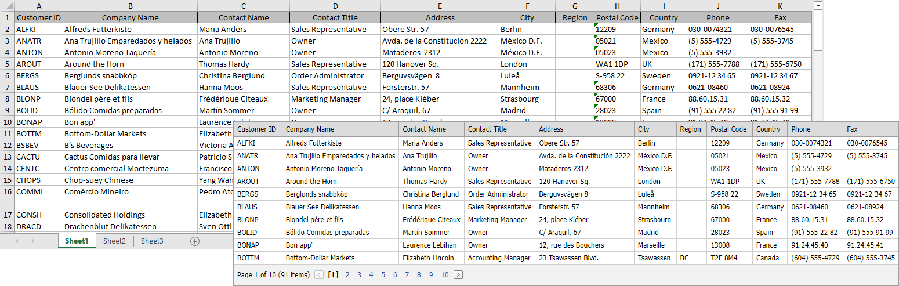

<!-- default badges list -->

<!-- default badges end -->

# Grid View for ASP.NET Web Forms - How to bind grid to an Excel file
<!-- run online -->
**[[Run Online]](https://codecentral.devexpress.com/e4457/)**
<!-- run online end -->

The [ASPxGridView](https://docs.devexpress.com/AspNet/DevExpress.Web.ASPxGridView) control does not work directly with real storage (like databases, MS office files, etc.). Load an Excel file into a standard ADO.NET DataTable object and use it as an ASPxGridView DataSource.

## Files to Review

* [Default.aspx](./CS/WebSite/Default.aspx) (VB: [Default.aspx](./VB/WebSite/Default.aspx))
* [Default.aspx.cs](./CS/WebSite/Default.aspx.cs) (VB: [Default.aspx.vb](./VB/WebSite/Default.aspx.vb))

## More Examples

* [Grid View for ASP.NET MVC - How to bind grid to an Excel file](https://github.com/DevExpress-Examples/asp-net-mvc-grid-bind-to-excel-file)
